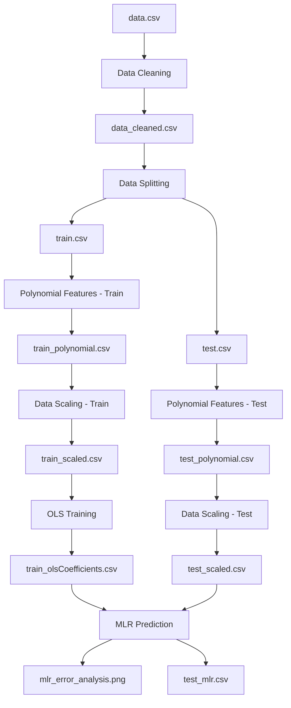

# Analisis Regresi Linear Berganda (MLR) 
## Pipeline Data Processing dan Prediksi

Repository ini berisi implementasi lengkap pipeline analisis regresi linear berganda menggunakan metode Ordinary Least Squares (OLS) untuk prediksi dan analisis error.

---

## 📊 **Alur Data Processing**

### **Input Awal**
```
📁 pre-prosesing/
└── data.csv                    # Dataset mentah
```

### **Pipeline Processing**



---

## 🔄 **Tahapan Processing**

### **1. Data Cleaning** 📝
**File**: `pre-prosesing/cleaning.py`
- **Input**: `data.csv`
- **Output**: `data_cleaned.csv`
- **Fungsi**: 
  - Menghapus baris yang mengandung nilai: `'-'`, `'8888'`, `'9999'`
  - Membersihkan data missing/invalid
  - Reset index data

### **2. Data Splitting** ✂️
**File**: `pre-prosesing/spliting.py`
- **Input**: `data_cleaned.csv`
- **Output**: 
  - `input_data/train.csv` (70% data)
  - `input_data/test.csv` (30% data)
- **Fungsi**:
  - Split data secara berurutan (sequential split)
  - Rasio default: 70:30 (training:testing)

### **3. Polynomial Features** 🔢
**File**: `pre-prosesing/polynomial_features.py`
- **Input**: 
  - `input_data/train.csv`
  - `input_data/test.csv`
- **Output**:
  - `polynomial_data/train_polynomial.csv`
  - `polynomial_data/test_polynomial.csv`
- **Fungsi**:
  - Membuat fitur polynomial (X₁², X₁×X₂, dll.) untuk meningkatkan kompleksitas model
  - Degree default: 2 (quadratic features)
  - Menangani interaksi antar variabel independent
  - Mengonversi categorical wind direction ke numerical values

### **4. Data Scaling** 📏
**File**: `pre-prosesing/scaleing.py`
- **Input**: 
  - `polynomial_data/train_polynomial.csv`
  - `polynomial_data/test_polynomial.csv`
- **Output**:
  - `output_data/train_scaled.csv`
  - `output_data/test_scaled.csv`
- **Fungsi**:
  - Normalisasi data menggunakan standardization (z-score)
  - Formula: `(x - mean) / std`
  - Memastikan semua fitur dalam skala yang sama

### **5. OLS Training** 🎯
**File**: `prosesing/ols.py`
- **Input**: `output_data/train_scaled.csv`
- **Output**: `train_olsCoefficients.csv`
- **Fungsi**:
  - Estimasi koefisien menggunakan metode OLS
  - Formula: β = (X'X)⁻¹X'y
  - Menghitung intercept dan slope untuk setiap variabel

### **6. MLR Prediction & Analysis** 📈
**File**: `prosesing/mlr.py`
- **Input**: 
  - `train_olsCoefficients.csv` (koefisien model)
  - `output_data/test_scaled.csv` (data test)
- **Output**:
  - `test_mlr.csv` (hasil prediksi)
  - `mlr_error_analysis.png` (visualisasi error analysis)
- **Fungsi**:
  - Prediksi menggunakan model MLR
  - Analisis error: MAE, MSE, RMSE, R²
  - Visualisasi perbandingan actual vs predicted

---

## 📁 **Struktur File Output**

### **Pre-processing Results**
```
📁 pre-prosesing/
├── data_cleaned.csv           # Data setelah cleaning
├── 📁 input_data/
│   ├── train.csv             # Data training (70%)
│   └── test.csv              # Data testing (30%)
├── 📁 polynomial_data/
│   ├── train_polynomial.csv  # Data training dengan polynomial features
│   └── test_polynomial.csv   # Data testing dengan polynomial features
└── 📁 output_data/
    ├── train_scaled.csv      # Data training yang sudah di-scale
    └── test_scaled.csv       # Data testing yang sudah di-scale
```

### **Processing Results**
```
📁 prosesing/
├── train_olsCoefficients.csv  # Koefisien model OLS
├── test_mlr.csv              # Hasil prediksi MLR
└── mlr_error_analysis.png    # Visualisasi analisis error
```

---

## 🚀 **Cara Menjalankan**

### **Otomatis (Recommended)**
Jalankan seluruh pipeline dengan satu command:
```bash
./run_analysis.sh
```

### **Manual (Step by Step)**
```bash
# 1. Aktifkan virtual environment
source ./regresi_env/bin/activate

# 2. Data Cleaning
python ./pre-prosesing/cleaning.py

# 3. Data Splitting
python ./pre-prosesing/spliting.py

# 4. Polynomial Features
python ./pre-prosesing/polynomial_features.py

# 5. Data Scaling
python ./pre-prosesing/scaleing.py

# 6. OLS Training
python ./prosesing/ols.py

# 7. MLR Prediction
python ./prosesing/mlr.py
```

---

## 📊 **Output dan Hasil**

### **1. train_olsCoefficients.csv**
Berisi koefisien model OLS dengan kolom:
- `Variable`: Nama variabel
- `Coefficient`: Nilai koefisien β
- `Std_Error`: Standard error
- `t_value`: Nilai t-statistik
- `p_value`: P-value untuk uji signifikansi

### **2. test_mlr.csv**
Berisi hasil prediksi dengan kolom:
- Semua kolom input original
- `Predicted_RR`: Nilai prediksi dari model MLR
- `Residual`: Selisih antara actual dan predicted
- `Abs_Residual`: Absolute residual

### **3. mlr_error_analysis.png**
Visualisasi yang menampilkan:
- **Scatter Plot**: Actual vs Predicted values
- **Residual Plot**: Error distribution
- **Histogram**: Distribusi residual
- **Metrics**: MAE, MSE, RMSE, R² score

---

## 🎯 **Tujuan Analisis**

1. **Data Preparation**: Membersihkan dan mempersiapkan data untuk modeling
2. **Feature Scaling**: Menormalisasi data untuk performa model yang optimal
3. **Model Training**: Membangun model regresi linear berganda menggunakan OLS
4. **Prediction**: Melakukan prediksi pada data test
5. **Error Analysis**: Menganalisis performa model dengan berbagai metrik

---

## 📈 **Metrik Evaluasi**

- **MAE (Mean Absolute Error)**: Rata-rata absolute error
- **MSE (Mean Squared Error)**: Rata-rata squared error
- **RMSE (Root Mean Squared Error)**: Akar dari MSE
- **R² Score**: Koefisien determinasi (goodness of fit)

---

## 🔧 **Requirements**

Lihat `requirements.txt` untuk dependencies:
- pandas
- numpy
- matplotlib
- seaborn
- scikit-learn
- openpyxl

---

## 📝 **Notes**

- Dataset target variable: `RR`
- Split ratio: 70% training, 30% testing
- Scaling method: Z-score standardization
- Model: Multiple Linear Regression via OLS
- All paths menggunakan relative path untuk portabilitas

---

## 📚 **References**

### **Data Sources**
1. **BMKG Data Online** - Badan Meteorologi, Klimatologi, dan Geofisika
   - Link: https://dataonline.bmkg.go.id/data-harian
   - Sumber data cuaca dan iklim Indonesia

### **Academic References**
2. **Weather Prediction Using Multi Linear Regression Algorithm**
   - Authors: N Anusha, M Sai Chaithanya, and Guru Jithendranath Reddy
   - Published: IOP Conference Series: Materials Science and Engineering, Volume 590
   - Conference: International Conference on Frontiers in Materials and Smart System Technologies
   - Date: 10 April 2019, Tamil Nadu, India
   - DOI: 10.1088/1757-899X/590/1/012034
   - Link: https://iopscience.iop.org/article/10.1088/1757-899X/590/1/012034/meta

### **Mathematical Background**
3. **Mathematical Foundation Document**
   - Link: https://drive.google.com/file/d/1pVPWokZJRlGjps9rks7KxTspnGk0db4f/view?usp=sharing
   - Berisi teori matematika di balik implementasi MLR dan OLS

### **Textbook Reference**
4. **Numerical Methods for Engineers (6th Edition)**
   - Authors: Steven C. Chapra and Raymond P. Canale
   - Publisher: McGraw-Hill Education
   - ISBN: 978-0073397924
   - Referensi utama untuk metode numerik yang digunakan

---

*Generated by MLR Analysis Pipeline - Metode Numerik 2025*
